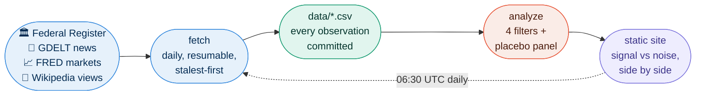

> Please read [LICENSE](LICENSE) and [DISCLAIMER.md](DISCLAIMER.md) before using this project.

# Correlation Engine

[](https://github.com/Codex-Crusader/Correlation-engine/actions/workflows/daily.yml)
[](https://codex-crusader.github.io/Correlation-engine/)
[](https://www.python.org/)


**[See the live site](https://codex-crusader.github.io/Correlation-engine/) - rebuilt daily by GitHub Actions. No server, no database, no paid APIs.**

---

Most correlation dashboards are machines for generating false claims: test
enough pairs and something always "significant" falls out. This one runs the
search anyway - 26 daily time series, every pair, every lag from −7 to +7
days - and then shows you, with equal visual weight, **what the identical
pipeline finds in pure noise.** It has been committing every observation and
every claim to this repo since day one, so its entire track record is
auditable in the git log.

---

## The Part Where the Numbers Confess

On a typical day this tool runs **~4,875 hypothesis tests**. At raw p < 0.05,
about **244 of them pass by pure chance**. The placebo panel - the same
pipeline on phase-randomized fake data with zero real relationships - finds
about **99 "significant" edges per run** even after correction.

```
tests run daily:      4,875
chance hits at p<.05:  ~244   (guaranteed, that's what p<.05 means)
noise pipeline finds:   ~99   (after FDR correction!)
edges published:          0   (so far - and that's correct)
```

That is why the publication bar is brutal. Passing the statistics *once*
means nothing. The site's headline panel puts the noise result next to the
real one, because if they look alike, you should trust nothing - and the
tool would rather tell you that than impress you.

## How it works



An **edge** = two *change* series moved together (possibly at a lag),
consistently, across two weeks of runs. To get published, an edge survives
four filters:

| # | Filter | Kills |
|---|--------|-------|
| 1 | **Stationarity** - difference until ADF passes, remove weekday cycle, Spearman on changes | spurious "two things that both trend" correlations (they correlate ~0.9 for no reason) |
| 2 | **FDR + effect size** - Benjamini–Hochberg q < 0.05 across ALL tests, then \|ρ\| ≥ 0.20 | the ~244 free chance hits per day |
| 3 | **Stability** - same pair, same sign, in ≥ 10 of the last 14 runs | one-day flukes (which is most survivors) |
| 4 | **Placebo panel** - identical pipeline on IAAFT surrogates, 20×/day | your overconfidence |

Published edges also carry a **common-driver annotation**: a partial Spearman
ρ with VIX changes conditioned out, labeling each edge "holds", "fades"
(likely everything-reacting-to-the-same-crisis co-movement), or "weekends,
not stress" (the edge lives in weekend rows the market conditioner cannot
see). It is context, never a fifth filter, and the placebo panel measures
its false-flag rate daily.

**Zero published edges is a valid, honest result.** The site says so itself.

## Quick start

```bash
pip install -r requirements.txt
python -m pytest tests/                    # stats tests first
FRED_API_KEY=yourkey python -m src.fetch   # first run backfills 2 years
python -m src.analyze
python -m src.render_site                  # → open docs/index.html
```

Deploying your own fork:

1. Add a free [FRED key](https://fred.stlouisfed.org/docs/api/fred/) as the `FRED_API_KEY` Actions secret (optional - FRED metrics skip without it).
2. Settings → Pages → Deploy from branch → `main`, folder `/docs`.
3. Put your repo URL in `USER_AGENT` (`src/fetchers/common.py`) and the site footer (`src/render_site.py`).
4. Actions → daily → Run workflow. Expect an empty graph for ~2 weeks - the stability filter needs 10 runs before anything *can* publish.

## Data sources

| Source | What | Auth |
|---|---|---|
| [Federal Register](https://www.federalregister.gov/developers/documentation/api/v1) | Presidential documents per day | none |
| [GDELT DOC 2.0](https://blog.gdeltproject.org/gdelt-doc-2-0-api-debuts/) | Share of global news coverage per topic | none (throttles hard - [handled](docs/ARCHITECTURE.md#gdelt-specifics--the-only-source-that-fights-back)) |
| [FRED](https://fred.stlouisfed.org/docs/api/fred/) | Yields, VIX, FX, oil | free key |
| [Wikimedia Pageviews](https://wikimedia.org/api/rest_v1/) | Article views (bots excluded) | none |

Daily-frequency series only - mixing frequencies means resampling choices
that quietly manufacture autocorrelation.

## Docs

**[docs/ARCHITECTURE.md](docs/ARCHITECTURE.md)** is the deep dive: code-flow
diagrams for every stage, every config variable and module constant explained,
data formats, failure modes and how they self-heal, and how to add a metric
(spoiler: one YAML entry + one commit; a 60-day gate stops today's news from
picking today's metrics).

<details>
<summary><strong>Known limits, stated plainly</strong></summary>

- **Selection bias survives the gate.** The founding pool was chosen by a
  person with priors. The gate stops results-driven additions; it cannot make
  the initial choice neutral. The pool file's git history is the disclosure.
- **q-values are approximate** - a pair's 15 lags are positively dependent,
  not independent. That's one reason the placebo panel exists.
- **Zero-inflated series.** Executive orders are 0 most days; the Federal
  Register skips weekends. Spearman + weekday adjustment soften this, but
  sparse-event series are the pool's statistically weakest members.
- **GDELT availability.** Intermittent outages and aggressive rate limits;
  failures skip and the range-based refetch backfills on the next success.
- **This finds patterns, not truths.** The correct reading of any edge:
  "out of ~4,900 searches today, this pattern was the most persistent, and
  here is what pure noise produces under the same search." Nothing more.

</details>

<details>
<summary><strong>Why an edge is never a causal claim</strong></summary>

Government announcements usually *respond* to events, so even a clean
lead–lag ordering routinely points backwards, and most co-movement in this
pool is driven by a third thing (an election, a crisis, a news cycle)
touching both series. The tool never uses causal language - and neither
should you when quoting it. See [DISCLAIMER.md](DISCLAIMER.md).

</details>

## The Point of All This

This project is about statistical honesty, not discoveries. A dashboard that
publishes nothing for two weeks because nothing recurred is more defensible
than one that publishes 99 noise edges a day with confidence. The empty graph
is the right result until the data earns a full one.

> Run enough hypothesis tests and you will always find something. The only
> honest move is to run the same search on noise, print both numbers, and
> let the reader calibrate - which is exactly what the site does, every day.
