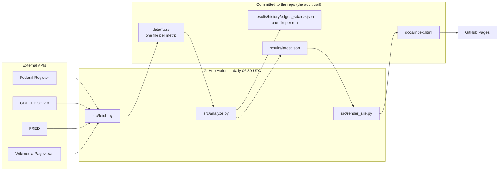
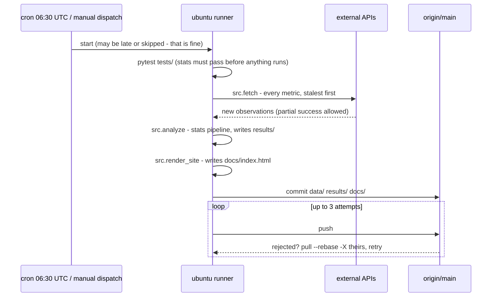
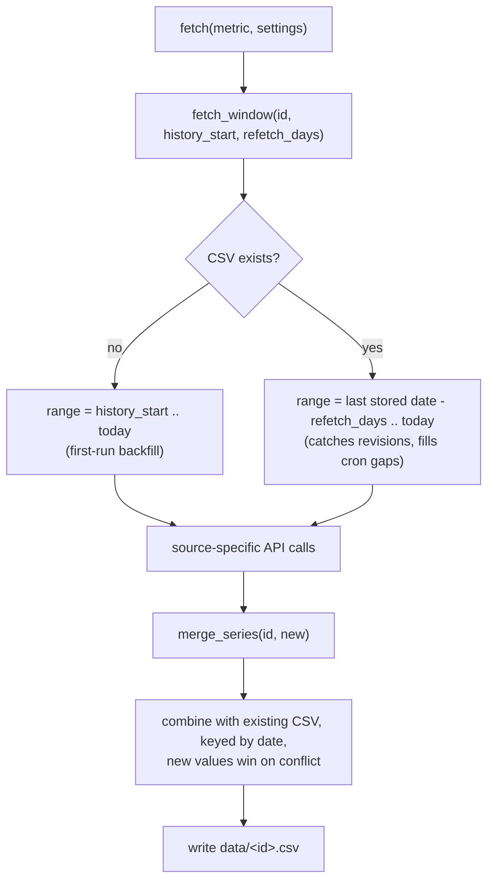
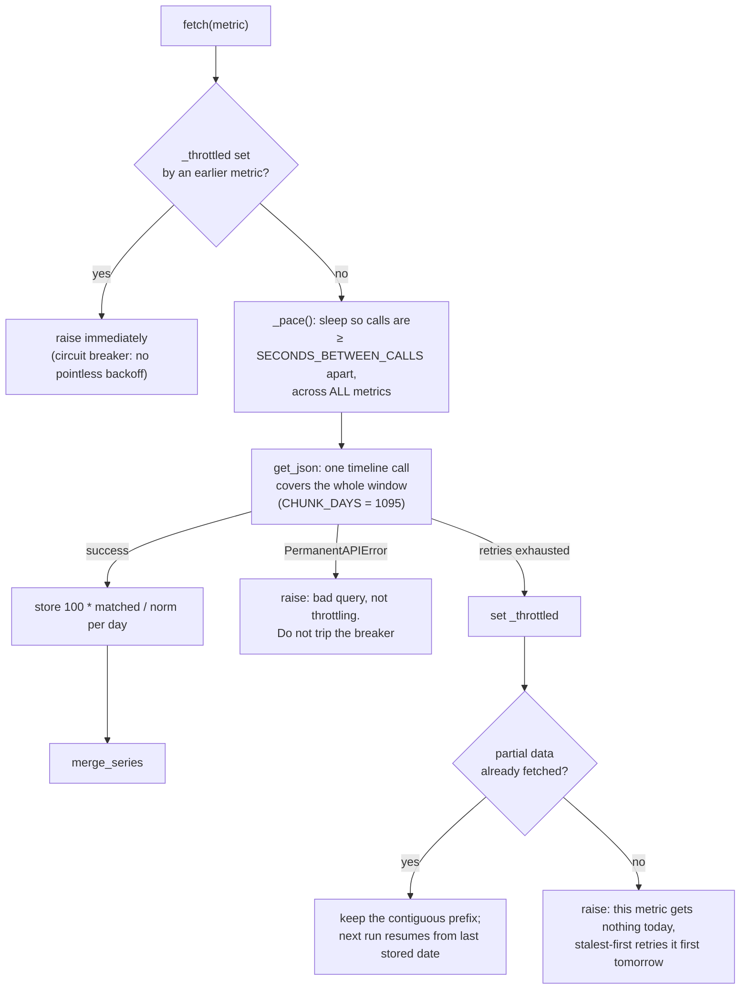
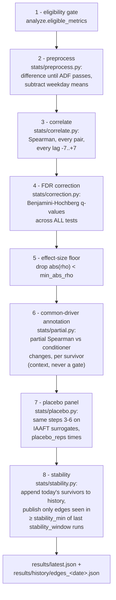

# Architecture and code flow

This is the developer-facing companion to the [README](../README.md), which
covers the statistical methodology and why it exists. This document covers
how the code actually moves: what runs when, which module owns what, every
tunable variable, and the data formats on disk.

GitHub renders the diagrams below natively (they are Mermaid blocks).

## The system at a glance



Everything the tool has ever seen or claimed is an ordinary git commit.
There is no server and no database; the repo *is* the database.

## The daily run

`.github/workflows/daily.yml`, one job, in order. Any fetch failure is
per-metric; the run only aborts if *nothing* was fetched.



The push loop exists because a manual dispatch can race the scheduled run;
everything committed is regenerated output, so the freshly generated local
version winning a conflict is always correct.

Late or skipped crons need no handling anywhere else: fetchers request date
*ranges* ending today (so gaps backfill themselves), merges are keyed by
date (so re-running a day is idempotent), and the stability filter counts
runs that happened, not calendar days.

## Fetch stage - `src/fetch.py` and `src/fetchers/`

`fetch.py` loads `config/metrics.yaml`, sorts metrics **stalest-first**
(never-fetched metrics first, then oldest last-stored date - so a metric
that missed out yesterday gets first claim on today's API budget), and
dispatches each to its source module by `metric["source"]`:

| Module | Source | One metric is... |
|---|---|---|
| `fetchers/federal_register.py` | Federal Register API | daily count of one presidential document subtype, explicit 0 on empty days |
| `fetchers/gdelt.py` | GDELT DOC 2.0 | daily share of global news coverage matching a query: `100 * matched / norm` |
| `fetchers/fred.py` | FRED | one daily economic series, needs `FRED_API_KEY` |
| `fetchers/wikipedia.py` | Wikimedia Pageviews | daily views of one article, bot traffic excluded |

All four share the same plumbing in `fetchers/common.py`:



### GDELT specifics - the only source that fights back

GDELT throttles per IP with a budget much stingier than its documented
"one request per 5 seconds", and GitHub-hosted runners share IP ranges with
other GDELT users. Exceeding the budget blocks the IP for **~20 minutes**,
which no sane in-run retry schedule can outlast. Four defences, all in
`fetchers/gdelt.py`:



1. **Few, big calls.** One `timelinevolraw` call serves years of daily data
   (verified: a 744-day request returned daily resolution), so a full
   backfill is one call per metric, not five.
2. **Global pacing.** `_pace()` enforces the gap between *every* GDELT
   call, whichever metric makes it. Pacing only within a metric would let
   single-call metrics fire back-to-back - that exact bug got CI blocked.
3. **Circuit breaker.** Once one call exhausts its retries, `_throttled`
   makes every remaining GDELT metric fail fast instead of each burning
   minutes of doomed backoff inside a 45-minute job.
4. **Resume.** Whatever was stored is committed; the next run's
   `fetch_window` continues from there, and stalest-first ordering puts
   yesterday's casualties at the front of the queue.

`common.get_json` handles the transport-level ugliness for everyone:
exponential backoff on 429/5xx/network errors, `Retry-After` respected
(capped at 300 s), and GDELT's habit of reporting both throttling *and*
query errors as HTTP 200 with a plain-text body - throttle text is retried,
anything else raises `PermanentAPIError` immediately.

## Analysis stage - `src/analyze.py` and `src/stats/`

One straight pipeline, nothing skippable, each step owned by one module:



Step notes that matter when reading the code:

- **Eligibility (1):** metrics added after `pool_founded` wait
  `eligibility_days` before entering, so today's news can never pick
  today's metrics. Founding-pool metrics are exempt - they were chosen
  before any results existed.
- **Preprocess (2):** a series that fails ADF after `MAX_DIFFS`
  differencings is dropped and logged in `preprocessing` - it cannot be
  honestly correlated. Order matters: difference first, then weekday-adjust
  the *changes*.
- **Correlate (3):** lag convention - a result with lag `k` correlates
  `a[t]` with `b[t + k]`, so positive `k` means changes in `metric_a` tend
  to precede changes in `metric_b`. Precedence is never presented as
  causation. `n_tests` counts every attempt, including pairs skipped for
  thin overlap, so the reported test count never understates the search.
- **Correction (4):** BH q-values are approximate here because a pair's 15
  lags are positively dependent, not independent - one reason the placebo
  panel exists at all.
- **Common-driver annotation (6):** each survivor gets a partial Spearman
  rho with the conditioner's changes removed, conditioning `a[t]` and
  `b[t + k]` each at its own timestamp. The verdict compares the partial
  against the raw rho recomputed on the same rows (the conditioner has no
  weekend values), so a shrunken sample cannot masquerade as a common
  driver: "fades" means the conditioning removed the edge, "weekends, not
  stress" means the edge was gone on trading days before conditioning.
  Pairs touching the conditioner itself get no verdict. Never a filter;
  the placebo panel measures how often noise earns each verdict.
- **Placebo (7):** surrogates are IAAFT (iterative amplitude-adjusted
  Fourier transform): exactly the original marginal distribution (ties
  and zero-inflation included), approximately the original power spectrum
  (so autocorrelation and "wiggliness"), all real cross-series
  relationships destroyed. NaN patterns are preserved so surrogates face
  the same overlap constraints. Chosen over shuffling because shuffling
  kills autocorrelation and makes noise look tamer than it is. Surrogate
  survivors are conditioned on the *real* conditioner series, which they
  are independent of by construction - that is what makes the reported
  verdict rates honest baselines.
- **Stability (8):** an edge's identity is `sorted(pair) + sign(rho)`
  (`stability.edge_key`), so a correlation that flips sign does not count
  as recurring. `best_lag_per_pair` collapses a pair's surviving lags to
  the strongest one - *after* correction, so it is display-only and cannot
  inflate significance.

## Render stage - `src/render_site.py`

Reads `results/latest.json`, substitutes `__MARKER__` placeholders into an
inline HTML template, writes `docs/index.html` (explicitly UTF-8 - the
template contains characters Windows' default cp1252 codec cannot encode).
The page's design rule: the noise panel gets the same visual weight as the
signal panel, and the honesty strip (tests run, expected chance hits,
placebo baseline) renders before any result.

## Configuration reference - `config/metrics.yaml`

### `settings`

| Variable | Value | What it does | What changing it means |
|---|---|---|---|
| `pool_founded` | `2026-07-13` | Metrics with `date_added` on or before this were chosen blind and skip the eligibility gate | Never move this forward; it is a historical fact about the pool |
| `history_start` | `2024-07-01` | First-ever fetch of a metric backfills from this date | Longer history = more overlap for tests, but slower first fetch |
| `refetch_days` | `14` | Every run re-requests this many trailing days per metric | Raise if a source revises data further back; costs nothing extra for GDELT (same single call) |
| `eligibility_days` | `60` | New metrics wait this long before entering the analysis | The anti-cherry-picking gate; shortening it weakens the design |
| `max_lag_days` | `7` | Lags tested are −7..+7, i.e. 15 tests per pair | Each extra day adds 2 tests per pair across the whole pool |
| `min_overlap` | `120` | Minimum overlapping observations for a (pair, lag) test | Below ~120 daily points, Spearman p-values get flaky |
| `fdr_q` | `0.05` | Benjamini–Hochberg threshold | The headline false-discovery budget |
| `min_abs_rho` | `0.20` | Effect-size floor after correction | Filters tiny-but-significant correlations that mean nothing |
| `conditioner` | `econ_vix` | Survivors also report a partial rho with this metric's changes conditioned out | Annotation only, never gates publication; changing it changes which common driver the verdicts speak about |
| `partial_min_overlap` | `60` | Minimum conditioner-overlapping days before a partial verdict | Below this the site shows "low overlap" instead of guessing |
| `stability_window` | `14` | Look at the last N runs *that happened* | Counting runs, not days, makes skipped crons harmless |
| `stability_min` | `10` | Edge must appear (same sign) in at least N of those runs | The main gate between "survived today" and "published" |
| `placebo_reps` | `20` | Surrogate universes per day | More reps = smoother noise baseline, linearly slower analysis |

### `metrics` entries

```yaml
- id: news_tariffs            # filename (data/<id>.csv) and analysis key
  source: gdelt               # which fetcher module handles it
  label: "News: tariffs"      # human name used on the site
  date_added: 2026-07-13      # start of the eligibility clock
  params: { query: "tariff OR tariffs" }   # source-specific
```

`params` by source: `federal_register` takes `subtype`
(`executive_order` / `proclamation` / `memorandum`), `gdelt` takes `query`
(OR'd terms are auto-parenthesized), `fred` takes `series_id`, `wikipedia`
takes `article` (exact title, underscores).

## Module constants

| Where | Constant | Value | Why this value |
|---|---|---|---|
| `fetchers/gdelt.py` | `CHUNK_DAYS` | `1095` | One timeline call serves years of daily data; bigger chunks = fewer calls = less throttling |
| `fetchers/gdelt.py` | `SECONDS_BETWEEN_CALLS` | `45` | At 10 s spacing GDELT blocks after ~4–7 calls; 45 s got 7 consecutive full-history calls through cleanly |
| `fetchers/gdelt.py` | `MAX_RETRIES` / `BASE_DELAY` | `5` / `10` | Waits 10/20/40/80 s between attempts; anything longer is pointless against a ~20-minute block |
| `fetchers/common.py` | `get_json` defaults | `max_retries=4, base_delay=5` | The gentler default for the sources that do not fight back |
| `fetchers/common.py` | `USER_AGENT` | repo URL + purpose | Wikimedia policy requires contact info; update it if you fork |
| `stats/preprocess.py` | `MAX_DIFFS` | `2` | A series still non-stationary after two differencings gets dropped, not tortured |
| `stats/preprocess.py` | `ADF_ALPHA` | `0.05` | ADF null is a unit root; p below this counts as stationary |
| `stats/preprocess.py` | `MIN_POINTS_FOR_ADF` | `60` | Below this the ADF test is not trustworthy; the series waits for more data |

## Data formats

**`data/<metric_id>.csv`** - the entire storage layer:

```csv
date,value
2026-07-13,0.9748…
2026-07-14,1.0132…
```

CSV, not Parquet, deliberately: the commit log is the audit trail and CSV
diffs are readable in a browser.

**`results/history/edges_<date>.json`** - what survived filters 1–2 on one
run (before stability). One file per run; this directory is the stability
filter's input and is never pruned.

**`results/latest.json`** - everything the site needs:

| Field | Meaning |
|---|---|
| `run_date`, `settings` | When, and with which knobs |
| `metrics_in_analysis` / `metrics_waiting_on_eligibility` | Who made it past the gate |
| `preprocessing[]` | Per metric: `ok` (+ `n_diffs`, `n_points`), `no data`, or `dropped: not stationary` |
| `n_pairs`, `n_tests` | The size of today's search |
| `expected_false_positives_at_p05` | `n_tests × 0.05` - the honesty headline |
| `n_survivors_today` | Passed FDR + effect size (before stability) |
| `runs_in_stability_window` | How many recent runs exist to count against |
| `stable_edges[]` | The published result: `metric_a`, `metric_b`, `lag`, `rho`, `p_value`, `q_value`, `n_overlap`, `appearances` |
| `placebo` | `reps`, per-rep `survivor_counts`, `mean_survivors`, `max_survivors`, `example_edges` (first rep, drawn on the site) |

## Adding a metric

1. Append an entry to `config/metrics.yaml` with today's `date_added`.
2. Commit. That commit *is* the disclosure - the pool's history is public.
3. The next run backfills it from `history_start`; it enters the analysis
   after `eligibility_days` (60). No other step exists, by design: there is
   no way to add a metric that starts influencing results immediately.

Keep the pool around 30–50 series; every addition multiplies `n_tests`, and
the honesty strip will show it.

## Failure modes and how they self-heal

| Failure | What happens | Recovery |
|---|---|---|
| GDELT blocks the IP mid-run | Breaker fails remaining GDELT metrics fast; partial prefixes are kept and committed | Next run: `fetch_window` resumes, stalest-first retries the casualties first |
| A source is down | That metric logs `FAIL`, run continues | Range-based refetch fills the hole on the next success |
| `FRED_API_KEY` missing | FRED metrics `SKIP` with a warning | Add the Actions secret |
| Cron skipped / late | Nothing special happens | Ranges end at *today*; the gap backfills itself |
| Two runs race on push | `git pull --rebase -X theirs`, up to 3 attempts | Freshly generated output always wins; both runs' data merges by date |
| A series goes non-stationary | Dropped for the day, logged in `preprocessing` | Re-tested from scratch every run |
| Every fetcher fails | `src.fetch` exits 1, workflow goes red | Investigate; analysis never runs on an empty fetch |
